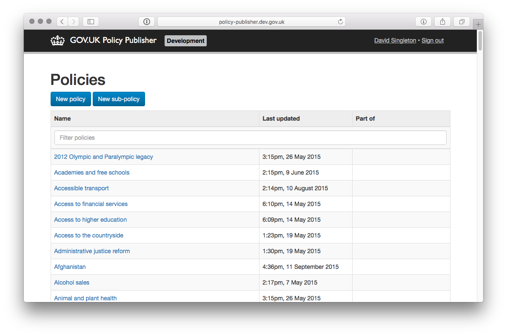

# Policy publisher

The policy publisher exists to create and manage policies and sub-policies. [Whitehall](https://github.com/alphagov/whitehall) allows departmental editors to tag content to these policies. The policy pages themself are "finders" and served by [finder-frontend](https://github.com/alphagov/finder-frontend).



## Nomenclature

- **Policy**: a broad overview of an area of government activity eg [domestic energy](https://www.gov.uk/government/policies/helping-households-to-cut-their-energy-bills).
- **Sub-policy**: specific activities the government is taking to support its objectives eg [Green Deal](https://www.gov.uk/government/policies/helping-households-to-cut-their-energy-bills/supporting-pages/green-deal).

## Technical documentation

This a Ruby on Rails application backed by PostgreSQL.

### Dependencies

- [publishing-api](https://github.com/alphagov/publishing-api)

### Running the application

Run `./startup.sh`.  This will start the application on port 3098.

If you're on the dev VM:

```
bowl policy-publisher
```

The application will appear on http://policy-publisher.dev.gov.uk/

### Running the tests

Run `bundle exec rake`

### Licence

[MIT Licence](LICENCE.txt)
